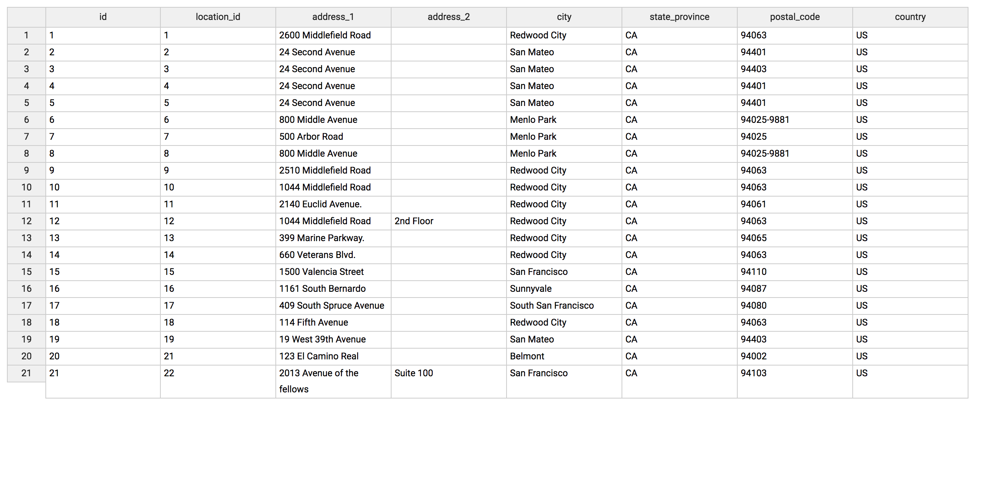

# Chrome CSV Viewer

This is a chrome extension that provides a tabular UI for viewing csv files.

It currently enables the following functionality:
1. column sorting with direction indicator
2. floating header (as the page scrolls)
3. manually adjusting column widths

It works for any sole csv content page.
